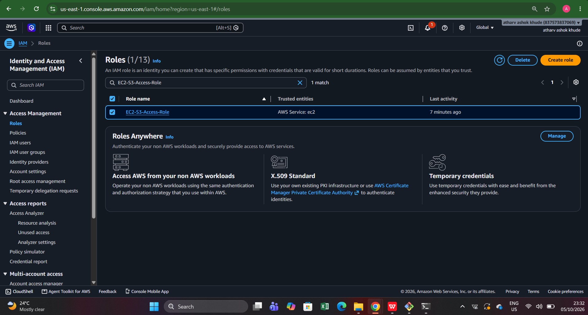
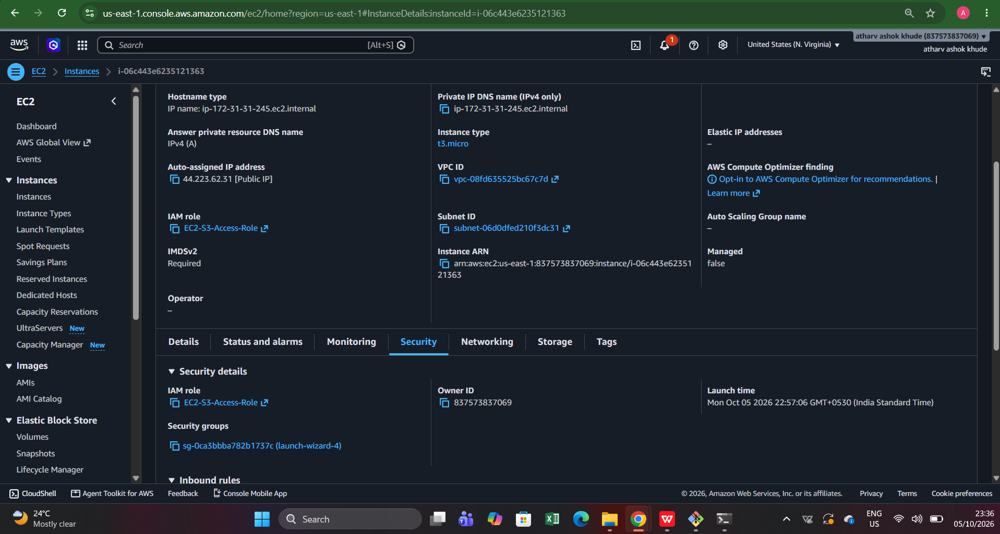
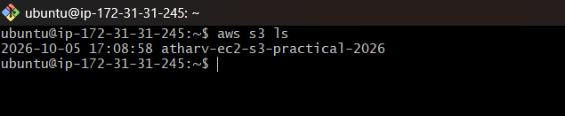
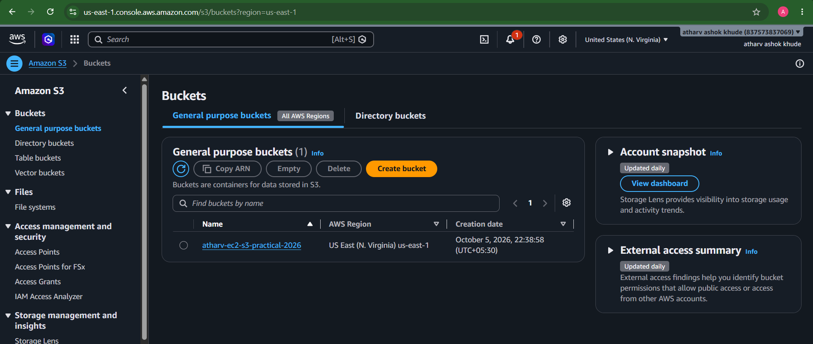
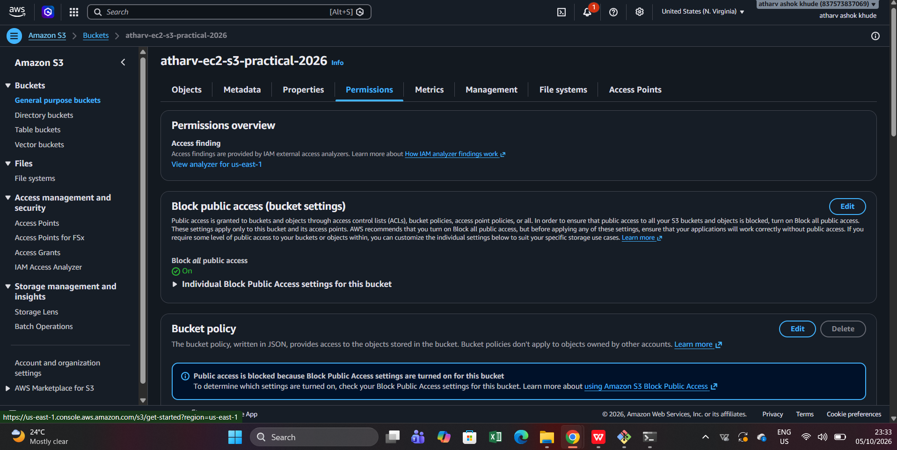
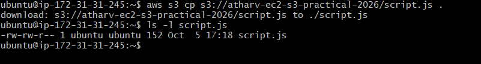

# AWS IAM Role for EC2 – Secure Amazon S3 Access

## 1. Project Overview

This practical demonstrates how to allow an **Amazon EC2 instance to access an Amazon S3 bucket without storing AWS access keys or secret keys on the server**.

Instead of hard-coding credentials, an **IAM Role** is attached to the EC2 instance. AWS automatically provides temporary credentials to the instance through the EC2 instance metadata service.

### Objective

- Create an IAM role for EC2.
- Grant the role permission to access an S3 bucket.
- Launch/use an EC2 instance with the IAM role attached.
- Connect to the EC2 instance through SSH.
- Verify that the AWS CLI is using the attached role.
- Access the S3 bucket successfully without configuring access keys.

---

## 2. Architecture

```text
                         AWS Account
                              |
                +-------------+-------------+
                |                           |
          IAM Role                     Amazon S3
     EC2-S3-Access-Role        atharv-ec2-s3-practical-2026
                |                           |
                |                           |
                +-------- EC2 Instance -----+
                         Ubuntu Linux
                              |
                         AWS CLI
                              |
                    Temporary IAM credentials
                    (No access keys stored)
```

### Access Flow

```text
EC2 Instance
     |
     | Assume attached IAM Role
     v
EC2-S3-Access-Role
     |
     | S3 permissions
     v
Amazon S3 Bucket
atharv-ec2-s3-practical-2026
```

---

## 3. Technologies / AWS Services Used

- Amazon EC2
- AWS Identity and Access Management (IAM)
- Amazon S3
- AWS CLI
- Ubuntu Linux
- SSH

---

## 4. IAM Role Creation

An IAM role named **`EC2-S3-Access-Role`** was created with **EC2 as the trusted AWS service**.

The role is intended to provide the EC2 instance with permission to interact with Amazon S3 without requiring permanent AWS access keys.

### Evidence

The IAM console shows the role and its trusted entity as **AWS Service: ec2**.



---

## 5. EC2 Instance with IAM Role Attached

The EC2 instance was launched/configured with the IAM role:

**`EC2-S3-Access-Role`**

The instance details confirm that the role is attached to the EC2 instance.

### Evidence



The screenshot also shows:

- Instance type: `t3.micro`
- IAM role: `EC2-S3-Access-Role`
- Instance ID: `i-06c443e6235121363`
- Region: `us-east-1`
- IMDSv2: Required

---

## 6. Connect to the EC2 Instance

The Ubuntu EC2 instance was accessed through SSH.

After login, the terminal prompt confirms access to the Ubuntu server.

### Evidence



---

## 7. Create / Verify the S3 Bucket

The S3 bucket used for this practical is:

**`atharv-ec2-s3-practical-2026`**

The bucket is located in:

**US East (N. Virginia) – `us-east-1`**

### Evidence



---

## 8. S3 Bucket Permissions

The S3 bucket permissions were reviewed in the AWS console.

The screenshot confirms that **Block all public access** is enabled for the bucket.

This is a secure configuration because access is intended to occur through AWS IAM permissions rather than public bucket access.

### Evidence



---

## 9. Test S3 Access from EC2

From the Ubuntu EC2 instance, the AWS CLI was used to list the available S3 buckets:

```bash
aws s3 ls
```

The command returned:

```text
2026-10-05 17:08:58 atharv-ec2-s3-practical-2026
```

This confirms that the EC2 instance can communicate with Amazon S3 using the permissions supplied through its IAM role.

### Evidence


---

## 10. Access an Object from S3

A file named **`script.js`** was copied from the S3 bucket to the EC2 instance using:

```bash
aws s3 cp s3://atharv-ec2-s3-practical-2026/script.js .
```

Then the downloaded file was verified with:

```bash
ls -l script.js
```

The output confirms that `script.js` was successfully downloaded to the Ubuntu server.

### Why this is important

No AWS access key or secret access key was supplied in the command.

The AWS CLI obtained temporary credentials through the IAM role attached to the EC2 instance.

---

## 11. Verify the IAM Role Identity

The identity used by the AWS CLI was verified using:

```bash
aws sts get-caller-identity
```

The returned identity shows an assumed role similar to:

```text
arn:aws:sts::837573837069:assumed-role/EC2-S3-Access-Role/i-06c443e6235121363
```

This is strong evidence that the EC2 instance is using the **`EC2-S3-Access-Role`** rather than a manually configured IAM user's access keys.

### Evidence



---

## 12. Complete Working Flow

The practical was completed using the following sequence:

1. Created the IAM role **`EC2-S3-Access-Role`**.
2. Configured EC2 as the trusted entity.
3. Granted S3 permissions to the role.
4. Attached the IAM role to the EC2 instance.
5. Connected to the Ubuntu EC2 instance through SSH.
6. Created/used the S3 bucket **`atharv-ec2-s3-practical-2026`**.
7. Executed `aws s3 ls` from EC2.
8. Successfully accessed the S3 bucket.
9. Copied `script.js` from S3 to the EC2 server.
10. Verified the file locally.
11. Ran `aws sts get-caller-identity`.
12. Confirmed that the AWS CLI was operating through the attached IAM role.

---

## 13. Security Benefits

Using an IAM role instead of storing AWS access keys on the EC2 server provides several security advantages:

- No permanent AWS access keys need to be stored on the instance.
- Temporary credentials are supplied automatically to the EC2 instance.
- Credentials can rotate automatically.
- Permissions can be controlled centrally through IAM policies.
- Access can be revoked by removing/changing the IAM role or its policies.
- The solution follows the AWS principle of least privilege when the role is limited to the required S3 actions.

---

## 14. Key Commands

### List S3 buckets

```bash
aws s3 ls
```

### Copy an object from S3 to EC2

```bash
aws s3 cp s3://atharv-ec2-s3-practical-2026/script.js .
```

### Verify downloaded file

```bash
ls -l script.js
```

### Verify the AWS identity

```bash
aws sts get-caller-identity
```

---

## 15. Expected Result

The final result demonstrates:

```text
EC2 Instance
    |
    | IAM Role: EC2-S3-Access-Role
    |
    v
AWS STS / Temporary Credentials
    |
    v
Amazon S3
    |
    v
atharv-ec2-s3-practical-2026
    |
    v
script.js
```

**Result: SUCCESS**

The EC2 instance successfully accessed Amazon S3 without storing AWS access keys on the server.

---

## 16. Conclusion

This practical demonstrates a secure AWS access-management pattern in which an EC2 instance accesses Amazon S3 through an **IAM role**.

The successful `aws s3 ls`, S3 object download, and `aws sts get-caller-identity` outputs verify that the EC2 instance received and used temporary credentials associated with **`EC2-S3-Access-Role`**.

This approach is preferred over embedding long-term AWS credentials in application code, shell scripts, or server configuration files.

---

## 17. Evidence Screenshots

| Step | Evidence |
|---|---|
| IAM role creation | `01-iam-role.png` |
| EC2 role attachment | `02-ec2-instance-role.png` |
| SSH login | `03-ssh-login.png` |
| S3 bucket | `04-s3-bucket.png` |
| S3 permissions | `05-bucket-permissions.png` |
| S3 access from EC2 | `06-s3-access-from-ec2.png` |
| IAM identity verification | `07-identity-verification.png` |

---

### Practical Status

**Completed successfully — EC2 accesses S3 using an IAM role without storing AWS access keys on the EC2 server.**
